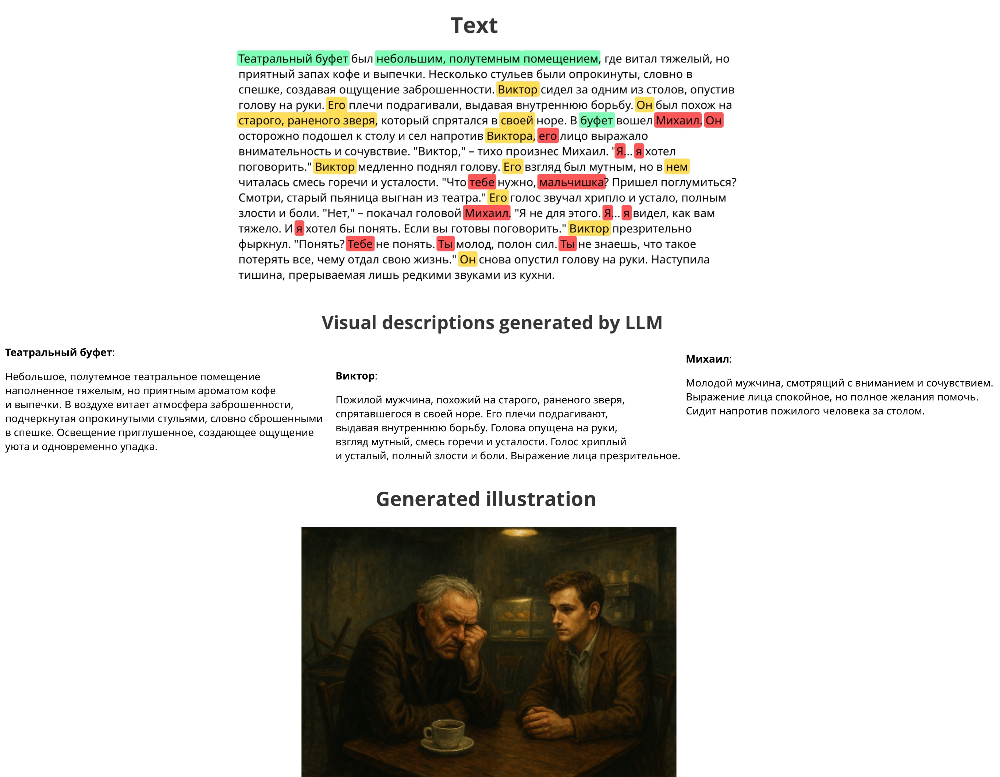

# Illustory: An NLP Pipeline for Generating Visual Descriptions

This project proposes an NLP pipeline designed for the automatic extraction of detailed visual descriptions of entities (characters, locations) from Russian literary texts. The ultimate goal is to create prompts for text-to-image models to generate illustrations for books.

## Pipeline Architecture

1.  **Preprocessing**: The text is cleaned of artifacts (headings, footnotes) and parsed using `UDPipe` into the CoNLL-U format.
2.  **Coreference Resolution**: The modified `CorPipe` model identifies all entity mentions in the text.
3.  **Long-Distance Cluster Merging**: The custom `clusterer.py` module analyzes and merges clusters that refer to the same entity but were separated due to the model's context window limitations.
4.  **Sentence Classification**: A fine-tuned `ruBert-base` model filters for sentences with visual descriptions for each entity.
5.  **Final Description Generation**: An LLM aggregates the filtered sentences into a single, cohesive visual description.

## Example

Here you can see how illustory extracts all entity mentions in the text, and generates visual discriptions for text-to-image generative model.



## Installation and Usage

1. **Install dependencies:**
    ```bash
    pip install -r requirements.txt
    ```

2. **Download necessary models:**
    ```bash
    bash scripts/udpipe_setup.sh
    ```
   
3. **Run the pipeline:**
    ```bash
    ```

## Project Structure

Only key files and directories are highlighted here.

```
.
├── report.pdf                # Project report
├── src/                      # Main source code for pipeline orchestration
│   └── after_coref/          # Scripts for post-processing after coreference
│       ├── sentence_classifier.py # Sentence classifier
│       └── generate_prompts.py    # Fine-tuning/logic for description generation
│
├── long-corpipe/             # Adapted Coreference Resolution model
│   ├── corpipe24.py          # Modified core CorPipe model script
│   └── clusterer.py          # Custom module for merging entity clusters
│
├── notebooks/                # Book dataset analysis (EDA) and text preprocessing scripts
│
└── demo/                     # Demo web application
    └── app.py
```